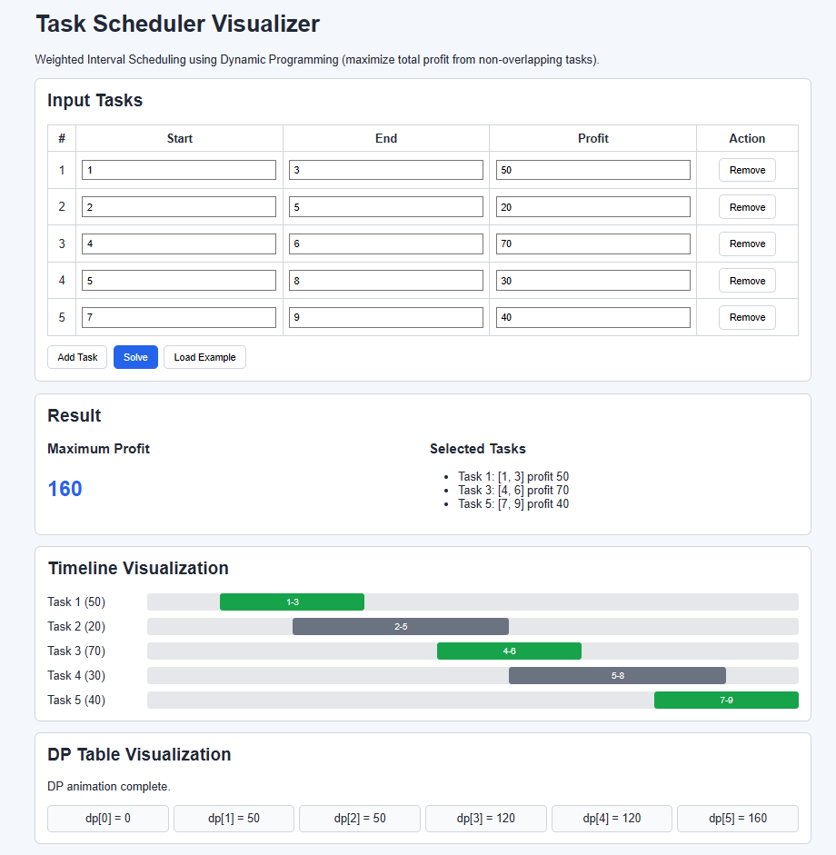

# Task Scheduler Visualizer using Dynamic Programming
### (Weighted Interval Scheduling)

A premium, interactive web application that visualizes how Dynamic Programming solves the **Weighted Interval Scheduling** problem step-by-step.

---

## Overview

Imagine you are managing freelance jobs. Each task has:
- start time
- end time
- profit

You can only work on one task at a time.  
The goal is to select **non-overlapping tasks** such that total profit is maximized.

This visualizer shows exactly how the DP table is built, how include/exclude decisions are made, and which tasks are finally selected.

---

## Screenshots


---

## Problem Definition

### Input
A list of tasks:

```json
{
  "tasks": [
    { "id": 1, "start": 1, "end": 3, "profit": 50 },
    { "id": 2, "start": 2, "end": 5, "profit": 20 },
    { "id": 3, "start": 4, "end": 6, "profit": 70 }
  ]
}
```

### Output
- Maximum profit
- Selected non-overlapping tasks
- Full DP states for visualization

### Constraints
- `1 <= n <= 1000` tasks
- `0 <= start < end <= 10^6`
- `0 <= profit <= 10^6`

### Example
Tasks: `(1,3,50), (2,5,20), (4,6,70), (6,7,60)`  
Optimal selection: `(1,3,50), (4,6,70), (6,7,60)`  
Maximum profit: `180`

---

## Why Dynamic Programming (Not Greedy)?

Greedy choices like:
- earliest ending task first
- highest profit task first
- shortest task first

can fail because a locally optimal task may block a better global combination.

Weighted Interval Scheduling works with DP because it has:
- **Optimal substructure**
- **Overlapping subproblems**

Recurrence:

```text
dp[i] = max(
  profit[i] + dp[p(i)],   // include current task
  dp[i - 1]               // exclude current task
)
```

Where `p(i)` is the index of the last non-overlapping task before task `i`.

---

## Algorithm Core (Python)

File: `python_core/weighted_interval.py`

Includes:
- Brute force solution (`O(2^n)`)
- Optimized DP + binary search (`O(n log n)`)
- DP table construction
- Decision tracking (`include` vs `exclude`)
- Backtracking selected tasks
- `dp_states` snapshots for frontend animation

### Complexity
- **Brute force:** Time `O(2^n)`, Space `O(n)`
- **DP optimized:** Time `O(n log n)`, Space `O(n)`

---

## Tech Stack

- **Frontend:** HTML, CSS, Vanilla JavaScript
- **Backend API Gateway:** Node.js, Express
- **Algorithm Core Service:** Python (child process integration)

---

## Key Features

- Step-by-step DP table animation
- Include vs exclude decision visualization
- Timeline bars for all tasks
- Selected tasks highlighted distinctly
- Dynamic task input (add/remove rows)
- Sample dataset loader for quick demo

---

## API Contract

### `POST /solve`

Request body:

```json
{
  "tasks": [
    { "id": 1, "start": 1, "end": 3, "profit": 50 }
  ]
}
```


## Visualization Details

### DP Table Animation
- Fills `dp[0..n]` progressively
- Highlights active cell each step
- Displays current include/exclude comparison

### Timeline Visualization
- Draws each task as a bar from `start` to `end`
- Colors selected tasks in green
- Keeps unselected tasks neutral for contrast

---

## Project Structure

```text
task_scheduler_coding_skills/
├── client/
│   ├── index.html
│   ├── styles.css
│   └── script.js
│
├── server/
│   ├── package.json
│   └── src/
│       ├── server.js
│       ├── routes/
│       │   └── solveRoutes.js
│       └── controllers/
│           └── solveController.js
│
├── python_core/
│   └── weighted_interval.py
│
└── README.md
```

---

## How to Run Locally

### 1) Install and start backend
```bash
cd server
npm install
npm start
```

Backend runs on: `http://localhost:3000`

### 2) Open frontend
Open:

```text
client/index.html
```

Or directly visit:

```text
http://localhost:3000
```
